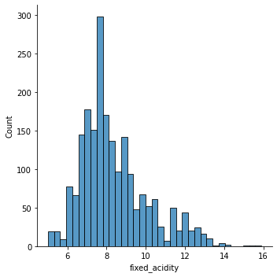

```python
# !git clone 'https://github.com/lifeflavor0425/kaggle_playground-series-season-3-episode-5.git'
```

# 데이터 준비(수집,준비)

- quality : target 값


```python
import pandas as pd
import numpy as np

test = pd.read_csv('/content/drive/MyDrive/cloud_ai/3.머신러닝/playground-series-season-3-episode-5/test.csv', index_col='Id')
train = pd.read_csv('/content/drive/MyDrive/cloud_ai/3.머신러닝/playground-series-season-3-episode-5/train.csv',index_col='Id')
submission = pd.read_csv('/content/drive/MyDrive/cloud_ai/3.머신러닝/playground-series-season-3-episode-5/sample_submission.csv',index_col='Id')
train.shape, test.shape, submission.shape
```


    ((2056, 12), (1372, 11), (1372, 1))


- 원본 데이터 추가


```python
wine_ori = pd.read_csv('/content/drive/MyDrive/cloud_ai/3.머신러닝/playground-series-season-3-episode-5/WineQT.csv', index_col='Id')
wine_ori.shape
```


    (1143, 12)


### 데이터 결측치 확인


```python
train.info()
```

    <class 'pandas.core.frame.DataFrame'>
    Int64Index: 2056 entries, 0 to 2055
    Data columns (total 12 columns):
     #   Column                Non-Null Count  Dtype  
    ---  ------                --------------  -----  
     0   fixed acidity         2056 non-null   float64
     1   volatile acidity      2056 non-null   float64
     2   citric acid           2056 non-null   float64
     3   residual sugar        2056 non-null   float64
     4   chlorides             2056 non-null   float64
     5   free sulfur dioxide   2056 non-null   float64
     6   total sulfur dioxide  2056 non-null   float64
     7   density               2056 non-null   float64
     8   pH                    2056 non-null   float64
     9   sulphates             2056 non-null   float64
     10  alcohol               2056 non-null   float64
     11  quality               2056 non-null   int64  
    dtypes: float64(11), int64(1)
    memory usage: 208.8 KB


```python
test.info()
```

    <class 'pandas.core.frame.DataFrame'>
    Int64Index: 1372 entries, 2056 to 3427
    Data columns (total 11 columns):
     #   Column                Non-Null Count  Dtype  
    ---  ------                --------------  -----  
     0   fixed acidity         1372 non-null   float64
     1   volatile acidity      1372 non-null   float64
     2   citric acid           1372 non-null   float64
     3   residual sugar        1372 non-null   float64
     4   chlorides             1372 non-null   float64
     5   free sulfur dioxide   1372 non-null   float64
     6   total sulfur dioxide  1372 non-null   float64
     7   density               1372 non-null   float64
     8   pH                    1372 non-null   float64
     9   sulphates             1372 non-null   float64
     10  alcohol               1372 non-null   float64
    dtypes: float64(11)
    memory usage: 128.6 KB


```python
wine_ori.info()
```

    <class 'pandas.core.frame.DataFrame'>
    Int64Index: 1143 entries, 0 to 1597
    Data columns (total 12 columns):
     #   Column                Non-Null Count  Dtype  
    ---  ------                --------------  -----  
     0   fixed acidity         1143 non-null   float64
     1   volatile acidity      1143 non-null   float64
     2   citric acid           1143 non-null   float64
     3   residual sugar        1143 non-null   float64
     4   chlorides             1143 non-null   float64
     5   free sulfur dioxide   1143 non-null   float64
     6   total sulfur dioxide  1143 non-null   float64
     7   density               1143 non-null   float64
     8   pH                    1143 non-null   float64
     9   sulphates             1143 non-null   float64
     10  alcohol               1143 non-null   float64
     11  quality               1143 non-null   int64  
    dtypes: float64(11), int64(1)
    memory usage: 116.1 KB


- 해석 
  - 모든 데이터에 결측치는 없다

- 타겟 값 확인


```python
train['quality'].unique()
```


    array([6, 7, 5, 4, 8, 3])


- 피처 띄어쓰기 지우기


```python
for feat in train.iloc[:,:7].columns:
  train.rename(columns={f'{feat}': feat.replace(' ', '_')}, inplace=True)
```

## 요약표 - summary

### train 


```python
summary = pd.DataFrame(train.dtypes, columns=['dtype']).reset_index().rename(columns={'index': 'features'})
def make_summary(df):
    print(f'데이터셋 형상: {df.shape}')
    summary = pd.DataFrame(df.dtypes, columns=['데이터 타입'])
    summary = summary.reset_index()
    summary = summary.rename(columns={'index': '피처'})
    summary['결측값 개수'] = df.isnull().sum().values
    summary['고윳값 개수'] = df.nunique().values
    summary['첫 번째 값'] = df.loc[0].values
    summary['두 번째 값'] = df.loc[1].values
    summary['세 번째 값'] = df.loc[2].values
    return summary
summary = make_summary(train)
summary

```

    데이터셋 형상: (2056, 12)


  <div id="df-8331145d-32ff-417a-8ebe-1036cc086c5e">
    <div class="colab-df-container">
      <div>
<style scoped>
    .dataframe tbody tr th:only-of-type {
        vertical-align: middle;
    }

    .dataframe tbody tr th {
        vertical-align: top;
    }

    .dataframe thead th {
        text-align: right;
    }
</style>
<table border="1" class="dataframe">
  <thead>
    <tr style="text-align: right;">
      <th></th>
      <th>피처</th>
      <th>데이터 타입</th>
      <th>결측값 개수</th>
      <th>고윳값 개수</th>
      <th>첫 번째 값</th>
      <th>두 번째 값</th>
      <th>세 번째 값</th>
    </tr>
  </thead>
  <tbody>
    <tr>
      <th>0</th>
      <td>fixed_acidity</td>
      <td>float64</td>
      <td>0</td>
      <td>87</td>
      <td>8.00000</td>
      <td>9.30000</td>
      <td>7.1000</td>
    </tr>
    <tr>
      <th>1</th>
      <td>volatile_acidity</td>
      <td>float64</td>
      <td>0</td>
      <td>113</td>
      <td>0.50000</td>
      <td>0.30000</td>
      <td>0.5100</td>
    </tr>
    <tr>
      <th>2</th>
      <td>citric_acid</td>
      <td>float64</td>
      <td>0</td>
      <td>71</td>
      <td>0.39000</td>
      <td>0.73000</td>
      <td>0.0300</td>
    </tr>
    <tr>
      <th>3</th>
      <td>residual_sugar</td>
      <td>float64</td>
      <td>0</td>
      <td>66</td>
      <td>2.20000</td>
      <td>2.30000</td>
      <td>2.1000</td>
    </tr>
    <tr>
      <th>4</th>
      <td>chlorides</td>
      <td>float64</td>
      <td>0</td>
      <td>103</td>
      <td>0.07300</td>
      <td>0.09200</td>
      <td>0.0590</td>
    </tr>
    <tr>
      <th>5</th>
      <td>free_sulfur_dioxide</td>
      <td>float64</td>
      <td>0</td>
      <td>49</td>
      <td>30.00000</td>
      <td>30.00000</td>
      <td>3.0000</td>
    </tr>
    <tr>
      <th>6</th>
      <td>total_sulfur_dioxide</td>
      <td>float64</td>
      <td>0</td>
      <td>126</td>
      <td>39.00000</td>
      <td>67.00000</td>
      <td>12.0000</td>
    </tr>
    <tr>
      <th>7</th>
      <td>density</td>
      <td>float64</td>
      <td>0</td>
      <td>313</td>
      <td>0.99572</td>
      <td>0.99854</td>
      <td>0.9966</td>
    </tr>
    <tr>
      <th>8</th>
      <td>pH</td>
      <td>float64</td>
      <td>0</td>
      <td>77</td>
      <td>3.33000</td>
      <td>3.32000</td>
      <td>3.5200</td>
    </tr>
    <tr>
      <th>9</th>
      <td>sulphates</td>
      <td>float64</td>
      <td>0</td>
      <td>73</td>
      <td>0.77000</td>
      <td>0.67000</td>
      <td>0.7300</td>
    </tr>
    <tr>
      <th>10</th>
      <td>alcohol</td>
      <td>float64</td>
      <td>0</td>
      <td>53</td>
      <td>12.10000</td>
      <td>12.80000</td>
      <td>11.3000</td>
    </tr>
    <tr>
      <th>11</th>
      <td>quality</td>
      <td>int64</td>
      <td>0</td>
      <td>6</td>
      <td>6.00000</td>
      <td>6.00000</td>
      <td>7.0000</td>
    </tr>
  </tbody>
</table>
</div>
      <button class="colab-df-convert" onclick="convertToInteractive('df-8331145d-32ff-417a-8ebe-1036cc086c5e')"
              title="Convert this dataframe to an interactive table."
              style="display:none;">

  <svg xmlns="http://www.w3.org/2000/svg" height="24px"viewBox="0 0 24 24"
       width="24px">
    <path d="M0 0h24v24H0V0z" fill="none"/>
    <path d="M18.56 5.44l.94 2.06.94-2.06 2.06-.94-2.06-.94-.94-2.06-.94 2.06-2.06.94zm-11 1L8.5 8.5l.94-2.06 2.06-.94-2.06-.94L8.5 2.5l-.94 2.06-2.06.94zm10 10l.94 2.06.94-2.06 2.06-.94-2.06-.94-.94-2.06-.94 2.06-2.06.94z"/><path d="M17.41 7.96l-1.37-1.37c-.4-.4-.92-.59-1.43-.59-.52 0-1.04.2-1.43.59L10.3 9.45l-7.72 7.72c-.78.78-.78 2.05 0 2.83L4 21.41c.39.39.9.59 1.41.59.51 0 1.02-.2 1.41-.59l7.78-7.78 2.81-2.81c.8-.78.8-2.07 0-2.86zM5.41 20L4 18.59l7.72-7.72 1.47 1.35L5.41 20z"/>
  </svg>
      </button>

  <style>
    .colab-df-container {
      display:flex;
      flex-wrap:wrap;
      gap: 12px;
    }

    .colab-df-convert {
      background-color: #E8F0FE;
      border: none;
      border-radius: 50%;
      cursor: pointer;
      display: none;
      fill: #1967D2;
      height: 32px;
      padding: 0 0 0 0;
      width: 32px;
    }

    .colab-df-convert:hover {
      background-color: #E2EBFA;
      box-shadow: 0px 1px 2px rgba(60, 64, 67, 0.3), 0px 1px 3px 1px rgba(60, 64, 67, 0.15);
      fill: #174EA6;
    }

    [theme=dark] .colab-df-convert {
      background-color: #3B4455;
      fill: #D2E3FC;
    }

    [theme=dark] .colab-df-convert:hover {
      background-color: #434B5C;
      box-shadow: 0px 1px 3px 1px rgba(0, 0, 0, 0.15);
      filter: drop-shadow(0px 1px 2px rgba(0, 0, 0, 0.3));
      fill: #FFFFFF;
    }
  </style>

      <script>
        const buttonEl =
          document.querySelector('#df-8331145d-32ff-417a-8ebe-1036cc086c5e button.colab-df-convert');
        buttonEl.style.display =
          google.colab.kernel.accessAllowed ? 'block' : 'none';

        async function convertToInteractive(key) {
          const element = document.querySelector('#df-8331145d-32ff-417a-8ebe-1036cc086c5e');
          const dataTable =
            await google.colab.kernel.invokeFunction('convertToInteractive',
                                                     [key], {});
          if (!dataTable) return;

          const docLinkHtml = 'Like what you see? Visit the ' +
            '<a target="_blank" href=https://colab.research.google.com/notebooks/data_table.ipynb>data table notebook</a>'
            + ' to learn more about interactive tables.';
          element.innerHTML = '';
          dataTable['output_type'] = 'display_data';
          await google.colab.output.renderOutput(dataTable, element);
          const docLink = document.createElement('div');
          docLink.innerHTML = docLinkHtml;
          element.appendChild(docLink);
        }
      </script>
    </div>
  </div>


### wine_ori 원본데이터


```python
make_summary(wine_ori)
```

    데이터셋 형상: (1143, 12)


  <div id="df-298017bf-de9b-4c00-bb77-99c35269b172">
    <div class="colab-df-container">
      <div>
<style scoped>
    .dataframe tbody tr th:only-of-type {
        vertical-align: middle;
    }

    .dataframe tbody tr th {
        vertical-align: top;
    }

    .dataframe thead th {
        text-align: right;
    }
</style>
<table border="1" class="dataframe">
  <thead>
    <tr style="text-align: right;">
      <th></th>
      <th>피처</th>
      <th>데이터 타입</th>
      <th>결측값 개수</th>
      <th>고윳값 개수</th>
      <th>첫 번째 값</th>
      <th>두 번째 값</th>
      <th>세 번째 값</th>
    </tr>
  </thead>
  <tbody>
    <tr>
      <th>0</th>
      <td>fixed acidity</td>
      <td>float64</td>
      <td>0</td>
      <td>91</td>
      <td>7.4000</td>
      <td>7.8000</td>
      <td>7.800</td>
    </tr>
    <tr>
      <th>1</th>
      <td>volatile acidity</td>
      <td>float64</td>
      <td>0</td>
      <td>135</td>
      <td>0.7000</td>
      <td>0.8800</td>
      <td>0.760</td>
    </tr>
    <tr>
      <th>2</th>
      <td>citric acid</td>
      <td>float64</td>
      <td>0</td>
      <td>77</td>
      <td>0.0000</td>
      <td>0.0000</td>
      <td>0.040</td>
    </tr>
    <tr>
      <th>3</th>
      <td>residual sugar</td>
      <td>float64</td>
      <td>0</td>
      <td>80</td>
      <td>1.9000</td>
      <td>2.6000</td>
      <td>2.300</td>
    </tr>
    <tr>
      <th>4</th>
      <td>chlorides</td>
      <td>float64</td>
      <td>0</td>
      <td>131</td>
      <td>0.0760</td>
      <td>0.0980</td>
      <td>0.092</td>
    </tr>
    <tr>
      <th>5</th>
      <td>free sulfur dioxide</td>
      <td>float64</td>
      <td>0</td>
      <td>53</td>
      <td>11.0000</td>
      <td>25.0000</td>
      <td>15.000</td>
    </tr>
    <tr>
      <th>6</th>
      <td>total sulfur dioxide</td>
      <td>float64</td>
      <td>0</td>
      <td>138</td>
      <td>34.0000</td>
      <td>67.0000</td>
      <td>54.000</td>
    </tr>
    <tr>
      <th>7</th>
      <td>density</td>
      <td>float64</td>
      <td>0</td>
      <td>388</td>
      <td>0.9978</td>
      <td>0.9968</td>
      <td>0.997</td>
    </tr>
    <tr>
      <th>8</th>
      <td>pH</td>
      <td>float64</td>
      <td>0</td>
      <td>87</td>
      <td>3.5100</td>
      <td>3.2000</td>
      <td>3.260</td>
    </tr>
    <tr>
      <th>9</th>
      <td>sulphates</td>
      <td>float64</td>
      <td>0</td>
      <td>89</td>
      <td>0.5600</td>
      <td>0.6800</td>
      <td>0.650</td>
    </tr>
    <tr>
      <th>10</th>
      <td>alcohol</td>
      <td>float64</td>
      <td>0</td>
      <td>61</td>
      <td>9.4000</td>
      <td>9.8000</td>
      <td>9.800</td>
    </tr>
    <tr>
      <th>11</th>
      <td>quality</td>
      <td>int64</td>
      <td>0</td>
      <td>6</td>
      <td>5.0000</td>
      <td>5.0000</td>
      <td>5.000</td>
    </tr>
  </tbody>
</table>
</div>
      <button class="colab-df-convert" onclick="convertToInteractive('df-298017bf-de9b-4c00-bb77-99c35269b172')"
              title="Convert this dataframe to an interactive table."
              style="display:none;">

  <svg xmlns="http://www.w3.org/2000/svg" height="24px"viewBox="0 0 24 24"
       width="24px">
    <path d="M0 0h24v24H0V0z" fill="none"/>
    <path d="M18.56 5.44l.94 2.06.94-2.06 2.06-.94-2.06-.94-.94-2.06-.94 2.06-2.06.94zm-11 1L8.5 8.5l.94-2.06 2.06-.94-2.06-.94L8.5 2.5l-.94 2.06-2.06.94zm10 10l.94 2.06.94-2.06 2.06-.94-2.06-.94-.94-2.06-.94 2.06-2.06.94z"/><path d="M17.41 7.96l-1.37-1.37c-.4-.4-.92-.59-1.43-.59-.52 0-1.04.2-1.43.59L10.3 9.45l-7.72 7.72c-.78.78-.78 2.05 0 2.83L4 21.41c.39.39.9.59 1.41.59.51 0 1.02-.2 1.41-.59l7.78-7.78 2.81-2.81c.8-.78.8-2.07 0-2.86zM5.41 20L4 18.59l7.72-7.72 1.47 1.35L5.41 20z"/>
  </svg>
      </button>

  <style>
    .colab-df-container {
      display:flex;
      flex-wrap:wrap;
      gap: 12px;
    }

    .colab-df-convert {
      background-color: #E8F0FE;
      border: none;
      border-radius: 50%;
      cursor: pointer;
      display: none;
      fill: #1967D2;
      height: 32px;
      padding: 0 0 0 0;
      width: 32px;
    }

    .colab-df-convert:hover {
      background-color: #E2EBFA;
      box-shadow: 0px 1px 2px rgba(60, 64, 67, 0.3), 0px 1px 3px 1px rgba(60, 64, 67, 0.15);
      fill: #174EA6;
    }

    [theme=dark] .colab-df-convert {
      background-color: #3B4455;
      fill: #D2E3FC;
    }

    [theme=dark] .colab-df-convert:hover {
      background-color: #434B5C;
      box-shadow: 0px 1px 3px 1px rgba(0, 0, 0, 0.15);
      filter: drop-shadow(0px 1px 2px rgba(0, 0, 0, 0.3));
      fill: #FFFFFF;
    }
  </style>

      <script>
        const buttonEl =
          document.querySelector('#df-298017bf-de9b-4c00-bb77-99c35269b172 button.colab-df-convert');
        buttonEl.style.display =
          google.colab.kernel.accessAllowed ? 'block' : 'none';

        async function convertToInteractive(key) {
          const element = document.querySelector('#df-298017bf-de9b-4c00-bb77-99c35269b172');
          const dataTable =
            await google.colab.kernel.invokeFunction('convertToInteractive',
                                                     [key], {});
          if (!dataTable) return;

          const docLinkHtml = 'Like what you see? Visit the ' +
            '<a target="_blank" href=https://colab.research.google.com/notebooks/data_table.ipynb>data table notebook</a>'
            + ' to learn more about interactive tables.';
          element.innerHTML = '';
          dataTable['output_type'] = 'display_data';
          await google.colab.output.renderOutput(dataTable, element);
          const docLink = document.createElement('div');
          docLink.innerHTML = docLinkHtml;
          element.appendChild(docLink);
        }
      </script>
    </div>
  </div>


## 시각화

### 타겟데이터 분포도 확인


```python
import seaborn as sns
import matplotlib.pyplot as plt
%matplotlib inline
```


```python
sns.displot( train['quality'] );
```


### 각 피처 분포도 확인


```python
# 바차트
from sklearn.preprocessing import StandardScaler, RobustScaler, MinMaxScaler
for idx,feat in enumerate(train.iloc[:,:-1].columns) :
  sns.displot((train[feat]))
```





```python
sns.displot((train[['fixed_acidity']]))
sns.displot( MinMaxScaler().fit_transform(train[['fixed_acidity']]))

```


    <seaborn.axisgrid.FacetGrid at 0x7f41626be730>


- 해석 
  - 스케일러를 한 데이터와 원본 데이터의 분포도가 유사하고 정규분포 형태로 나타남
  - MinMaxScaler 사용

### 연속형 데이터 시각화 - 산점도, 산포도 


```python
# 3줄 2칸 행렬형태로 차트 준비
fig, axes = plt.subplots(nrows=6, ncols=2,)
fig.set_size_inches(30,30) # 전체 크기 조정

# 바차트
for idx,feat in enumerate(train.iloc[:,:-1].columns) :
  sns.regplot(x=feat, y='quality', data=train, ax=axes[idx//2, idx%2], line_kws={'color': 'red'}, scatter_kws={'alpha':0.5})
  

```


- 해석 
  - 타겟값이 대부분 5,6에 집중되어 있는 만큼 빨간선이 5와 6사이에 위치할수록 영향도가 큼
  - 하지만, 영향도가 적은 피처를 사용하지 않는다면 점수가 떨어짐

### 피처간 상관관계 파악


```python
corr_values = train.iloc[:,:-1].corr()
sns.heatmap(corr_values, annot=True)
```


    <matplotlib.axes._subplots.AxesSubplot at 0x7f41623c4d90>


- 해석 
  - 0.9 초과 x -> 강한 상관관계가 없다

### 이상치 확인
  - residual_sugar 에서 14보다 큰 값은 test 데이터에 없음 -> 제거
  - chlorides 에서 이상치 값은 test 값에서도 존재 -> 유지
  - sulphates 에서 train은 2.0에 근접한 값이 있고, test는 1.6이 있음 -> 비슷하니깐 유지


```python
# 이상치 : residual_sugar, 
sns.kdeplot(data=train, x='residual_sugar')
sns.rugplot(data=train, x='residual_sugar');
```


```python
sns.kdeplot(data=test, x='residual sugar')
sns.rugplot(data=test, x='residual sugar');
```


```python
sns.kdeplot(data=wine_ori, x='residual sugar')
sns.rugplot(data=wine_ori, x='residual sugar');
```


# EDA 분석

- train, test 데이터 
  - 피처 파악
      - 모든 데이터가 실수형 -> 연속형
      - 데이터의 범위가 피처마다 제각각,

  - 타겟데이터(quality) 분포도 확인
    - 5 값이 가장 많다
    - 타겟데이터가 분류형과 유사
    - 각각의 실수형 데이터를 분류모델로 학습해서 분류형태로 가야함

  - 연속형 데이터 시각화 - 산점도, 산포도 
    - quality 5와6의 값이 가장 많아서, 중앙에서 떨어지거나, 올라가는 추세가 보임
    - 타겟값이 대부분 5,6에 집중되어 있는 만큼 빨간선이 5와 6사이에 위치할수록 영향도가 큼

  - 피처간 상관관계 파악
    - 0.9 초과 x -> 강한 상관관계가 없다

  - 이상치 
    -  residual_sugar, chlorides, sulphates 에서 동떨어진 데이터 확인
      - **residual_sugar 에서 14보다 큰 값은 test 데이터에 없음 -> 제거**
      - 나머지는 test 데이터에서도 유사하게 존재 -> 유지
  - 결측치
    - train, test 데이터 모두 결측치 없음


- 추가 데이터 Wine_ori
  - 대체로 train 데이터의 분포와 유사
  - 이상치
    - residual_sugar 에서 14보다 큰 값이 4개 존재, 
    - train 데이터와 차별을 주기 위해서, 훼손하지 않고 진행
  - 결측치
    - 결측치 없음


## cohen_kappa_score
  - 대회에서 평가하는 수식,
  - 캐글 토론에서 참고하여 사용
  - 1에 가까울수록 좋은 지표

# 베이스라인

## 데이터 준비


```python
import pandas as pd
import numpy as np
# 스케일링
from sklearn.preprocessing import MinMaxScaler, StandardScaler
from sklearn.model_selection import train_test_split, KFold
# 알고리즘
from sklearn.ensemble import RandomForestClassifier
from xgboost import XGBClassifier
from lightgbm import LGBMClassifier
# 기타
from sklearn.model_selection import GridSearchCV
from sklearn.metrics import cohen_kappa_score, accuracy_score
```


```python
test = pd.read_csv('/content/drive/MyDrive/cloud_ai/3.머신러닝/playground-series-season-3-episode-5/test.csv', index_col='Id')
train = pd.read_csv('/content/drive/MyDrive/cloud_ai/3.머신러닝/playground-series-season-3-episode-5/train.csv',index_col='Id')
submission = pd.read_csv('/content/drive/MyDrive/cloud_ai/3.머신러닝/playground-series-season-3-episode-5/sample_submission.csv',index_col='Id')
train.shape, test.shape, submission.shape
```


    ((2056, 12), (1372, 11), (1372, 1))


### 오리진 데이터


```python
wine_ori = pd.read_csv('/content/drive/MyDrive/cloud_ai/3.머신러닝/playground-series-season-3-episode-5/WineQT.csv', index_col='Id')
wine_ori.shape
```


    (1143, 12)


```python
# 데이터 타입 설정
train['data_type'] = 1
test['data_type'] = 1
wine_ori['data_type'] = 0
```


```python
# 오리진 데이터 합산
train = pd.concat([train, wine_ori], axis=0)
train.shape
```


    (3199, 13)


```python
# 이상치 제거 
train  = train[train['residual sugar'].apply(lambda x : x < 13)]
```


```python
# 데이터 통합
train_test_df = pd.concat([train.drop( columns= train.iloc[:,[-2]]), test], axis=0).reset_index(drop=True)
y = train['quality']
```


```python
# 스케일링
for feat in train_test_df.columns :
  train_test_df[feat] = MinMaxScaler().fit_transform(train_test_df[[feat]])
```


```python
# 데이터 나누기
X = np.array(train_test_df.iloc[:3194,:])
X_sub = np.array(train_test_df.iloc[3194:,:])
X.shape, X_sub.shape, y.shape
```


    ((3194, 12), (1372, 12), (3194,))


```python
# train, test 데이터 생성
X_train, X_test, y_train, y_test = train_test_split(X, y, test_size=0.25, random_state=0)
X_train.shape, X_test.shape, y_train.shape, y_test.shape
```


    ((2395, 12), (799, 12), (2395,), (799,))


## 학습


```python
# 파라미터
params = {
  # 기본값
}

# 생성
rf_model = RandomForestClassifier(**params)
xgb_model = XGBClassifier(**params)
lgb_model = LGBMClassifier(**params)

# 학습
rf_model.fit(X_train, y_train)
xgb_model.fit(X_train, y_train)
lgb_model.fit(X_train, y_train)

# 예측
y_pred_rf = rf_model.predict(X_test)
y_pred_xgb = xgb_model.predict(X_test)
y_pred_lgb = lgb_model.predict(X_test)

```

## cohen_kappa_score
  - 대회에서 평가하는 수식,
  - 캐글 토론에서 참고하여 사용
  - 1에 가까울수록 좋은 지표


```python
print('RandomForestClassifier : \t',cohen_kappa_score(y_test,  y_pred_rf, weights = "quadratic"))
print('XGBClassifier : \t',cohen_kappa_score(y_test,  y_pred_xgb, weights = "quadratic"))
print('LGBMClassifier : \t',cohen_kappa_score(y_test,  y_pred_lgb, weights = "quadratic"))
```

    RandomForestClassifier : 	 0.557995752876143
    XGBClassifier : 	 0.5066753264491779
    LGBMClassifier : 	 0.5590178226128908


## 제출


```python
# 제출
sub_y_pred = xgb_model.predict( X_sub )
submission['quality'] = sub_y_pred
submission.to_csv( 'submission.csv' )
```

## 베이스라인 분석 결과

- EDA에 따라서 실행한 결과
  - 데이터를 스케일러 처리를 한 것 보다 안한것이 더 좋게 나왔다.
  - 이상치는 원본데이터(train)데이터만 처리한 것이 더 높게 나왔다
  - 각각의 피처를 제거하면서 수행한 결과 모든 피처를 살리는 방향이 더 높게 나왔다
  - xgb, lgb, cat, randomforest의 알고리즘을 수행한 결과 randomforest -> xgb -> lgb -> cat 순이였다. 
  - 캐글에서 많은 사람들이 사용한 새로운 피처를 생성하는 방식은 우리 데이터에서는 성능이 더 낮게 나왔다
  

## xgb 피처 중요도 시각화


```python
# 변수 중요도 시각화
from xgboost import plot_importance

_, ax = plt.subplots( figsize=(14,10) )
plot_importance( xgb_model, ax=ax );
```


- f11 -> 지우나 쓰나 점수에 크게 변동이 없어서 그냥 사용
- 나머지 피처는 제거시, 점수가 크게 하락함

# 최적화


```python
import pandas as pd
import numpy as np
import matplotlib.pyplot as plt
%matplotlib inline
# 스케일링
from sklearn.preprocessing import MinMaxScaler, StandardScaler
from sklearn.model_selection import train_test_split, StratifiedKFold
# 알고리즘
from xgboost import XGBClassifier
from lightgbm import LGBMClassifier
# 기타
from sklearn.metrics import cohen_kappa_score, accuracy_score
from sklearn.preprocessing import LabelEncoder
from scipy.stats import mode

# 데이터 준비
test = pd.read_csv('/content/drive/MyDrive/cloud_ai/3.머신러닝/playground-series-season-3-episode-5/test.csv', index_col='Id')
train = pd.read_csv('/content/drive/MyDrive/cloud_ai/3.머신러닝/playground-series-season-3-episode-5/train.csv',index_col='Id')
submission = pd.read_csv('/content/drive/MyDrive/cloud_ai/3.머신러닝/playground-series-season-3-episode-5/sample_submission.csv')
wine_ori = pd.read_csv('/content/drive/MyDrive/cloud_ai/3.머신러닝/playground-series-season-3-episode-5/WineQT.csv', index_col='Id')

# 데이터 타입 설정
train['data_type'] = 1
test['data_type'] = 1
wine_ori['data_type'] = 0

# 이상치 제거 
train  = train[train['residual sugar'].apply(lambda x : x < 13)]

# 오리진 데이터 합산
train = pd.concat([train, wine_ori], axis=0)

# 인덱스 리셋, 인덱스 컬럼 날리기
train = train.reset_index(drop=True)

# 타겟 값 라벨링 -> [3,4,5,6,7,8] -> [0,1,2,3,4,5] 값으로 변경
encoder = LabelEncoder()
train['quality'] = encoder.fit_transform(train['quality'])


```


```python
# KFold 사용
n=5
cv = StratifiedKFold( n,shuffle=True, random_state=42)

# 피처 목록 ( 'id', 'quality' 제외 )
features = [c for c in train.columns if c not in ['id', 'quality']]

# 각 kfold의 예측값을 배열에 삽입하기 위한 그릇
test_preds = []

for i,(train_idx,val_idx) in enumerate(cv.split(train[features],train['quality'])):
    X_train, y_train = train.loc[train_idx, features],train.loc[train_idx, 'quality']
    X_val, y_val = train.loc[val_idx, features],train.loc[val_idx, 'quality']
    
    # optuna를 이용해 찾은 파라미터 -> 미세하게 조정
    params={
        'n_estimators': 394,
        'num_leaves': 7,
        'min_child_samples': 3,
        'learning_rate': 0.20180592, #0.15961062177409088
        'colsample_bytree': 0.9999857982053186, #0.9999857982053186
        'reg_alpha': 0.0017, #0.0009765625
        'reg_lambda': 0.009702, #0.0009765625
    }
    
    # 모델 생성
    model = LGBMClassifier(**params)

    # 훈련
    model.fit(X_train, y_train, eval_set = [(X_val,y_val)], early_stopping_rounds=200, verbose=200)
    # 예측
    y_pred = model.predict(X_val)
    # 평가
    score = cohen_kappa_score(y_val,  y_pred, weights = "quadratic")
    test_pred = model.predict(test[features])
    test_preds.append(test_pred)
    print(f'=== Fold {i} Cohen Kappa Score {np.mean([score])} ===')

```

    Training until validation scores don't improve for 200 rounds.
    [200]	valid_0's multi_logloss: 1.08791
    Early stopping, best iteration is:
    [31]	valid_0's multi_logloss: 0.95572
    === Fold 0 Cohen Kappa Score 0.5008827108650566 ===
    Training until validation scores don't improve for 200 rounds.
    [200]	valid_0's multi_logloss: 1.08706
    Early stopping, best iteration is:
    [47]	valid_0's multi_logloss: 1.0004
    === Fold 1 Cohen Kappa Score 0.5152547369110592 ===
    Training until validation scores don't improve for 200 rounds.
    [200]	valid_0's multi_logloss: 1.19071
    Early stopping, best iteration is:
    [48]	valid_0's multi_logloss: 1.0552
    === Fold 2 Cohen Kappa Score 0.5005076950644075 ===
    Training until validation scores don't improve for 200 rounds.
    [200]	valid_0's multi_logloss: 1.05714
    Early stopping, best iteration is:
    [41]	valid_0's multi_logloss: 0.981831
    === Fold 3 Cohen Kappa Score 0.5214758967329222 ===
    Training until validation scores don't improve for 200 rounds.
    [200]	valid_0's multi_logloss: 1.10989
    Early stopping, best iteration is:
    [25]	valid_0's multi_logloss: 0.990198
    === Fold 4 Cohen Kappa Score 0.4969172465627647 ===


- 


```python
# np.column_stack : 배열의 각 행을 하나의 배열로 합쳐서 재구성하는 함수
# mode : 최빈값 계산 함수
# np.squeeze : 차원 축소 함수, [[1,2,3,4]] -> [1,2,3,4]
# encoder.inverse_transform : 라벨링 한 것을 다시 역변환하는 함수

submission['quality'] = encoder.inverse_transform(np.squeeze(mode(np.column_stack(test_preds),axis = 1)[0]).astype('int'))
submission.to_csv('submission.csv', index=False)
```


```python
# 캐글 자동 제출

#!pip install kaggle
#!mkdir -p ~/.kaggle
# 캐글 account에서 kaggle.json 파일 가져오기
#!cp kaggle.json ~/.kaggle/
#!chmod 600 ~/.kaggle/kaggle.json
# !kaggle competitions submit -c playground-series-s3e5 -f submission.csv -m "Message"
```


```python
# readme.md 파일로 변환
!jupyter nbconvert --to markdown "/content/drive/MyDrive/cloud_ai/3.머신러닝/playground-series-season-3-episode-5.ipynb"
```

    [NbConvertApp] Converting notebook /content/drive/MyDrive/cloud_ai/3.머신러닝/playground-series-season-3-episode-5.ipynb to markdown
    [NbConvertApp] Writing 11176 bytes to /content/drive/MyDrive/cloud_ai/3.머신러닝/playground-series-season-3-episode-5.md

